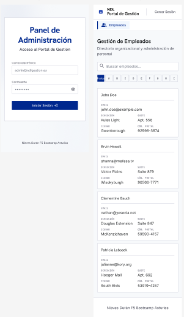
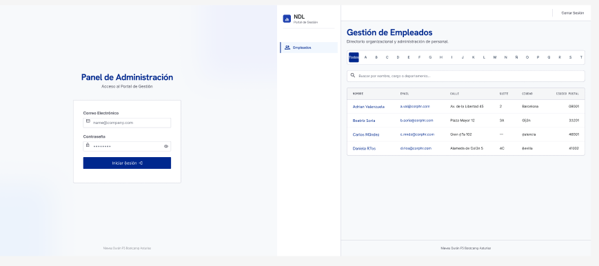
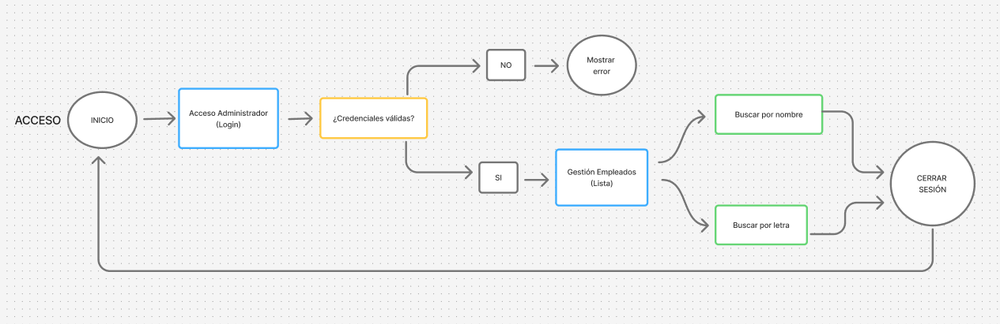
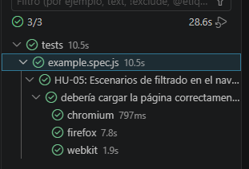
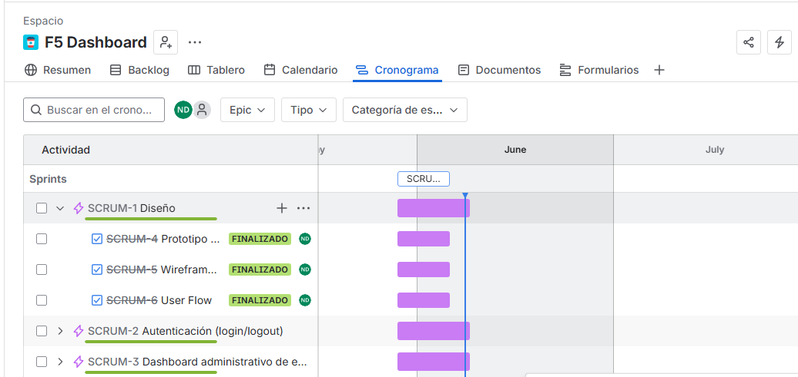
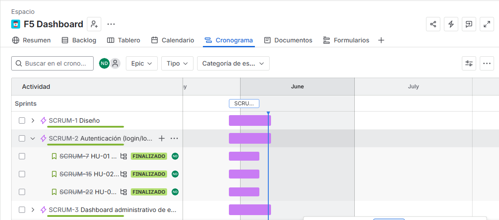
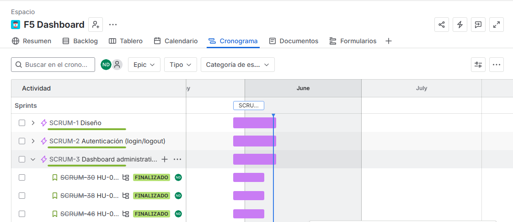

# Dashboard Administrativo de Gestión de Empleados

#  📝 Descripción

Este proyecto consiste en una aplicación web dinámica de tipo **dashboard administrativo** para la gestión interna de personal. 
La plataforma implementa un sistema de control de acceso privado que protege los datos organizacionales frente a usuarios no autenticados.

A nivel técnico, la aplicación valida las credenciales en el cliente y utiliza almacenamiento local persistente para el manejo del estado de la sesión. Una vez superada la autenticación, se realiza una petición asíncrona a una API REST externa para recuperar la información de los trabajadores, renderizándola dinámicamente en una **tabla administrativa organizada** que cuenta con controles interactivos de filtrado alfabético y por nombre.

# 🔍 Análisis
* **Portal de Sesión (Login)**: Formulario centralizado con validación síncrona de correo electrónico y contraseñas de alta seguridad (mínimo 8 caracteres y al menos un dígito).
* **Vista de Tabla Administrativa**: Visualización estructurada de empleados estructurada en columnas clave: Nombre, Email, Calle, Suite, Ciudad y Código Postal.
* **Filtrado Alfabético Superior**: Una barra de navegación con el abecedario completo (`Todos`, `A`, `B`, `C`...) para segmentar de forma instantánea a los empleados según la inicial de su nombre.
* **Barra de Búsqueda Integrada**: Filtro dinámico adicional para localizar trabajadores por nombre.
* **Persistencia en Navegador**: Mantenimiento de sesión activa mediante almacenamiento local, impidiendo la pérdida de estado al refrescar.

# 📷 Prototipo

# 👤↝ User Flow

# 📦 Instalación

En este proyecto se realizaron los siguientes pasos:

## Clonar el repositorio.
* **1-** git clone https://github.com/duran-ni/Dashboard-administrativo-empleados.git
* **2-** cd Dashboard-administrativo-empleados
* **3-** code .
## Inicialización del proyecto e Instalación de Dependencias
* **1-** npm init -y
* **2-** npm install -D vitest
* **3-** npm init playwright@latest  
## Creación de la Estructura de Carpetas
* **1-** mkdir -p src/assets/icons src/styles src/scripts
* **2-** touch index.html dashboard.html config.json src/styles/main.css src/styles/auth.css 
* **3-** src/styles/dashboard.css src/scripts/auth.js src/scripts/api.js src/scripts/storage.js src/scripts/ui.js

## Ejecutar Proyecto
**Paso 1:** Implementación de HTML del Login 

**Paso 2:** Implementación de Estilos CSS del Login

**Paso 3:** Borrar carpeta Dashboard con el comando: rm dashboard.html

**Paso 4:** Estructuración del HTML Unificado (SPA)

**Paso 5:** Implementar las Subtareas registradas en Jira

**Paso 6:** Vitest

#  🛠️ Planificación

# 📋 Historias de Usuario y Criterios de Aceptación

## HU-1  Acceso al dashboard administrativo 

**Como** usuario administrador

**Quiero** acceder a un dashboard mediante email y contraseña

**Para** poder gestionar la información de los empleados

**Criterios de aceptación:**

* **Escenario 1:** El sistema muestra un formulario con los campos 'Correo Electrónico' y 'Contraseña'.

**- Dado** que el usuario no está autenticado y accede a la URL del login

**- Cuando** la página carga

**- Entonces** se muestra un formulario con los campos 'Correo Electrónico' y 'Contraseña'

* **Escenario 2:** El campo de correo valida que el valor tenga formato de email válido (contenga '@' y dominio).

**- Dado** que el usuario introduce un valor en el campo de correo

**- Cuando** el sistema valida el campo

**- Entonces** se verifica que el valor tenga formato de email válido (contenga '@' y dominio)

* **Escenario 3:** El campo de contraseña es obligatorio y no puede estar vacío.

**- Dado** que el usuario deja el campo de contraseña vacío

**- Cuando** intenta enviar el formulario

**- Entonces** el sistema indica que el campo de contraseña es obligatorio y no permite el envío

* **Escenario 4:** Si las credenciales son correctas, el sistema redirige al usuario al dashboard.

**- Dado** que el usuario introduce credenciales correctas en ambos campos

**- Cuando** pulsa el botón 'Iniciar Sesión'

**- Entonces** el sistema autentica al usuario y le redirige al dashboard de empleados

* **Escenario 5:** Si las credenciales son incorrectas, el sistema muestra un mensaje de error sin especificar qué campo falla.

**- Dado** que el usuario introduce credenciales incorrectas

**- Cuando** pulsa el botón 'Iniciar Sesión'

**- Entonces** el sistema muestra un mensaje de error genérico sin indicar cuál de los dos campos es incorrecto

* **Escenario 6:** El botón 'Iniciar Sesión' permanece activo solo cuando ambos campos contienen texto.

**- Dado** que el usuario no ha rellenado al menos uno de los campos del formulario

**- Cuando** observa el botón 'Iniciar Sesión'

**- Entonces** el botón permanece desactivado e impide el envío del formulario

* **Escenario 7:** Tras un inicio de sesión exitoso, la sesión queda activa hasta que el usuario cierre sesión manualmente.

**- Dado** que el usuario ha iniciado sesión correctamente

**- Cuando** navega por el dashboard sin cerrar sesión

**- Entonces** la sesión permanece activa hasta que el usuario cierre sesión de forma manual

## HU-2 Mostrar y ocultar contraseña    

**Como** usuario administrador

**Quiero** poder mostrar u ocultar la contraseña que estoy escribiendo

**Para** verificar que la he introducido correctamente antes de iniciar sesión

**Criterios de aceptación:**

* **Escenario 1:** El campo de contraseña incluye un icono de ojo en su extremo derecho.

**- Dado** el usuario está en la pantalla de login

**- Cuando** observa el campo de contraseña

**- Entonces** se muestra un icono de ojo en el extremo derecho del campo

* **Escenario 2:** Por defecto, el texto de la contraseña se muestra enmascarado (puntos o asteriscos).

**- Dado** el usuario accede por primera vez al campo de contraseña

**- Cuando** comienza a escribir

**- Entonces** el texto se muestra enmascarado con puntos o asteriscos por defecto

* **Escenario 3:** Al pulsar el icono de ojo, el texto de la contraseña se muestra en claro.

**- Dado** el usuario tiene texto escrito en el campo de contraseña y el campo está enmascarado

**- Cuando** pulsa el icono de ojo

**- Entonces** el texto de la contraseña se muestra en claro

* **Escenario 4:** Al volver a pulsar el icono, la contraseña vuelve a ocultarse.

**- Dado** la contraseña está visible en claro

**- Cuando** el usuario vuelve a pulsar el icono de ojo

**- Entonces** el texto vuelve a ocultarse con la máscara

* **Escenario 5:** El icono cambia visualmente según el estado (ojo abierto / ojo tachado).

**- Dado** el usuario alterna entre mostrar y ocultar la contraseña

**- Cuando** cambia el estado del campo 

**- Entonces** el icono cambia visualmente (ojo abierto cuando está oculta, ojo tachado cuando está visible)

* **Escenario 6:** El contenido del campo no se borra al alternar entre mostrar y ocultar.

**- Dado** la contraseña contiene texto y el usuario alterna la visibilidad

**- Cuando** se hace el toggle

**- Entonces** el contenido del campo se conserva íntegramente sin borrarse

## HU-3 Logout del dashboard

**Como** usuario administrador autenticado

**Quiero** poder cerrar sesión desde el dashboard

**Para** que nadie más pueda usar mi sesión abierta

**Criterios de aceptación:**

* **Escenario 1:** El botón 'Cerrar Sesión' es visible en todo momento en la esquina superior derecha del dashboard.

**- Dado** el usuario está autenticado y se encuentra en cualquier página del dashboard

**- Cuando** observa la cabecera de la aplicación

**- Entonces** el botón 'Cerrar Sesión' es visible en la esquina superior derecha en todo momento

* **Escenario 2:** Al pulsar el botón, la sesión del usuario queda invalidada en el servidor.

**- Dado** el usuario pulsa el botón 'Cerrar Sesión'

**- Cuando** se procesa la petición de logout

**- Entonces** la sesión del usuario queda invalidada en el servidor

* **Escenario 3:** Tras cerrar sesión, el sistema redirige al usuario a la pantalla de login.

**- Dado** la sesión ha sido cerrada correctamente

**- Cuando** el logout se completa

**- Entonces** el sistema redirige automáticamente al usuario a la pantalla de login

* **Escenario 4:** Si el usuario intenta acceder a una URL del dashboard con la sesión cerrada, es redirigido al login.

**- Dado** el usuario ha cerrado sesión y conoce una URL interna del dashboard

**- Cuando** intenta acceder a esa URL directamente

**- Entonces** el sistema le redirige a la pantalla de login sin mostrar el contenido protegido

* **Escenario 5:** No se muestra ningún diálogo de confirmación antes de cerrar la sesión.

**- Dado** el usuario pulsa el botón 'Cerrar Sesión'

**- Cuando** se inicia el proceso de logout

**- Entonces** no se muestra ningún diálogo de confirmación y el cierre de sesión es inmediato

## HU-4 Listado de empleados

**Como** usuario administrador autenticado

**Quiero** ver un listado de empleados

**Para** consultar sus datos básicos de contacto y dirección

**Criterios de aceptación:**

* **Escenario 1:** Al acceder al dashboard se muestra la tabla con todos los empleados automáticamente.

**- Dado** el usuario está autenticado y accede al dashboard

**- Cuando** la página del dashboard termina de cargar

**- Entonces** se muestra automáticamente la tabla con todos los empleados registrados

* **Escenario 2:** La tabla muestra las columnas: Nombre, Email, Calle, Número, Ciudad y Código Postal.

**- Dado** la tabla de empleados está visible

**- Cuando** el usuario la observa

**- Entonces** se muestran las columnas Nombre, Email, Calle, Número, Ciudad y Código Postal

* **Escenario 3:** Cada fila corresponde a un empleado distinto con sus datos correctamente alineados.

**- Dado** existen varios empleados en el sistema

**- Cuando** se carga el listado

**- Entonces** cada fila corresponde a un único empleado con sus datos correctamente alineados en cada columna

* **Escenario 4:** Si no hay empleados registrados, se muestra un mensaje indicando que no existen registros.

**- Dado** no hay ningún empleado registrado en el sistema

**- Cuando** el dashboard carga el listado

**- Entonces** se muestra un mensaje indicando que no existen registros en lugar de una tabla vacía

* **Escenario 5:** Los datos se cargan desde el servidor sin necesidad de recargar la página.

**- Dado** el usuario está en el dashboard

**- Cuando** se obtienen los datos de empleados

**- Entonces** los datos se cargan desde el servidor sin necesidad de recargar la página manualmente

* **Escenario 6:** El listado muestra por defecto todos los empleados (filtro 'Todos' activo).

**- Dado** el usuario accede al dashboard sin haber aplicado ningún filtro

**- Cuando** se muestra el listado

**- Entonces** el filtro 'Todos' aparece activo y se visualizan todos los empleados 

## HU-5 Filtrado de empleados por primera letra del nombre

**Como** usuario administrador autenticado

**Quiero** filtrar el listado de empleados por la primera letra del nombre

**Para** encontrar más rápido a un empleado concreto

**Criterios de aceptación:**

* **Escenario 1:** Se muestra una barra de letras (A–T) junto con la opción 'Todos' al inicio.

**- Dado** el usuario está en el dashboard con el listado visible

**- Cuando** observa la barra de navegación del listado

**- Entonces** se muestra la opción 'Todos' y las letras de la A a la T

* **Escenario 2:** Al pulsar una letra, la tabla muestra únicamente los empleados cuyo nombre empieza por esa letra.

**- Dado** el usuario está en el dashboard y selecciona una letra, por ejemplo 'B'

**- Cuando** pulsa sobre esa letra

**- Entonces** la tabla muestra únicamente los empleados cuyo nombre empieza por 'B'

* **Escenario 3:** La letra seleccionada queda visualmente resaltada para indicar que el filtro está activo.

**- Dado** el usuario ha seleccionado una letra del filtro

**- Cuando** observa la barra de letras

**- Entonces** la letra seleccionada aparece visualmente resaltada respecto a las demás

* **Escenario 4:** Al pulsar 'Todos', se eliminan los filtros y se muestran todos los empleados.

**- Dado** el usuario tiene un filtro de letra activo

**- Cuando** pulsa sobre la opción 'Todos'

**- Entonces** se eliminan los filtros y la tabla vuelve a mostrar todos los empleados

* **Escenario 5:** Si no hay empleados para la letra seleccionada, la tabla muestra un mensaje informativo.

**- Dado** el usuario selecciona una letra para la que no existe ningún empleado

**- Cuando** se aplica el filtro

**- Entonces** la tabla muestra un mensaje informativo indicando que no hay resultados para esa letra

* **Escenario 6:** El filtro por letra es compatible con el buscador (ambos pueden actuar simultáneamente).

**- Dado** el usuario tiene activo el filtro por letra y el buscador de texto

**- Cuando** ambos filtros están aplicados simultáneamente

**- Entonces** la tabla muestra únicamente los empleados que cumplen ambos criterios a la vez

## HU-6 Búsqueda de empleados por nombre 

**Como** usuario administrador autenticado

**Quiero** buscar empleados escribiendo en un campo de texto

**Para** localizar rápidamente a un empleado concreto sin navegar por el listado completo

**Criterios de aceptación:**

* **Escenario 1:** El dashboard muestra un campo de búsqueda con el placeholder 'Buscar por nombre”.

**- Dado** el usuario está en el dashboard con el listado visible

**- Cuando** observa la parte superior del listado

**- Entonces** se muestra un campo de búsqueda con el placeholder 'Buscar por nombre’

* **Escenario 2:** La búsqueda se ejecuta de forma dinámica conforme el usuario escribe, sin necesidad de pulsar Enter.

**- Dado** el usuario empieza a escribir en el campo de búsqueda

**- Cuando** introduce cualquier carácter

**- Entonces** la tabla se actualiza dinámicamente sin necesidad de pulsar Enter

* **Escenario 3:** La tabla se actualiza mostrando únicamente los empleados que coincidan con el texto introducido.

**- Dado** el usuario ha escrito un término en el buscador

**- Cuando** el filtro se aplica

**- Entonces** la tabla muestra únicamente los empleados cuyo nombre contiene ese término

* **Escenario 4:** La búsqueda no distingue entre mayúsculas y minúsculas.

**- Dado** el usuario escribe un término en mayúsculas o minúsculas

**- Cuando** se ejecuta la búsqueda

**- Entonces** el sistema devuelve resultados sin distinguir entre mayúsculas y minúsculas

* **Escenario 5:** Si no hay coincidencias, la tabla muestra un mensaje indicando que no se han encontrado resultados.

**- Dado** el usuario ha escrito un término que no coincide con ningún empleado

**- Cuando** se aplica el filtro

**- Entonces** la tabla muestra un mensaje indicando que no se han encontrado resultados

* **Escenario 6:** Al borrar el texto del buscador, la tabla vuelve a mostrar todos los empleados (o los filtrados por letra).

**- Dado** el usuario borra el texto del campo de búsqueda

**- Cuando** el campo queda vacío

**- Entonces** la tabla vuelve a mostrar todos los empleados o los filtrados por letra si ese filtro está activo

* **Escenario 7:** El buscador es compatible con el filtro por letra (ambos pueden actuar simultáneamente).

**- Dado** el usuario tiene activo el filtro por letra y escribe en el buscador

**- Cuando** ambos filtros están aplicados simultáneamente

**- Entonces** la tabla muestra únicamente los empleados que cumplen ambos criterios a la vez

#  💻 Tecnologías Utilizadas

* HTML5
* CSS3
* JavaScript (vanilla)

# Usuario y Contraseña
**Usuario:** admin@company.com

**Contraseña:** password123

# ✍️ Autora

* duran-ni